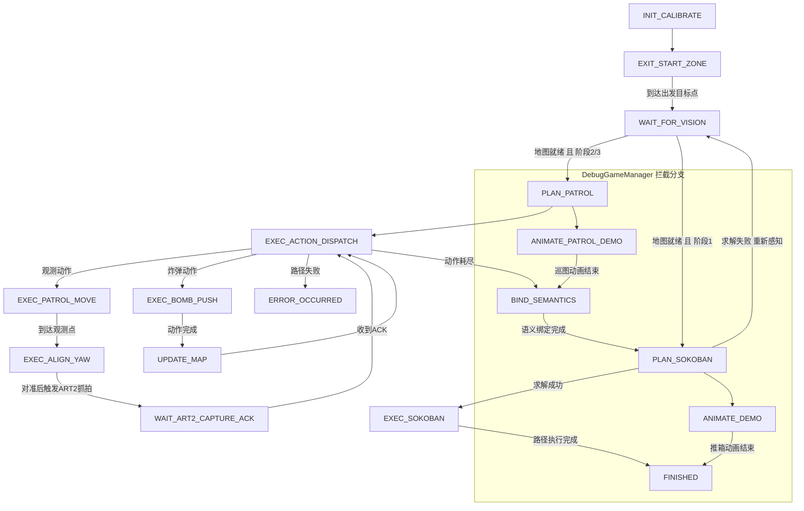

# 第21届全国大学生智能汽车竞赛 - 智能视觉组推箱子主控工程

本仓库是 RT1064 主控侧完整工程，面向智能视觉组推箱子赛题，覆盖视觉通信、巡图规划、推箱求解、底盘控制、姿态与里程计、遥测与调参显示等核心链路。

## 1. 硬件与平台

- 主控：NXP i.MX RT1064（Cortex-M7, 600MHz）
- 存储布局：ITCM / DTCM / OCRAM 分区优化
- 底盘：四轮麦克纳姆轮（编码器闭环）
- 视觉：双 OpenART（UART）
- 惯导：IMU 模块（工程内含 ICM42688 与通用 IMU 封装）
- 显示：TFT 菜单与状态可视化

## 2. 工程结构

```text
.
├── README.md
├── Algorithm_Planning_Memory_Analysis.md
├── libraries/                        # SDK、驱动、组件库（第三方与平台层）
│   ├── sdk/
│   ├── zf_common/
│   ├── zf_driver/
│   ├── zf_device/
│   ├── zf_components/
│   ├── components/
│   └── doc/
└── project/                          # 业务主工程
    ├── App/                          # 主循环、全局状态、业务状态机
    │   ├── main.cpp
    │   ├── GameManage.cpp/.h
    │   ├── RobotState.h
    │   └── TestMap.cpp/.h
    ├── Algorithm/                    # 算法层（规划 + 控制）
    │   ├── MotionControl.cpp/.h
    │   ├── Tracker.cpp/.h
    │   ├── Exploration.cpp/.h
    │   ├── Strategy.cpp/.h
    │   └── Sokoban.cpp/.h
    ├── Subsystem/                    # 业务子系统编排层
    │   ├── Vision.cpp/.h
    │   ├── ChassisControl.cpp/.h
    │   ├── PoseEstimate.cpp/.h
    │   ├── Telemetry.cpp/.h
    │   └── Display.cpp/.h
    ├── Device/                       # 设备抽象封装层
    │   ├── Motor.cpp/.h
    │   ├── Encoder.cpp/.h
    │   ├── Icm42688.cpp/.h
    │   ├── UartComm.cpp/.h
    │   └── Storage.cpp/.h
    ├── Core/                         # 调度、中断、系统与调参配置
    │   ├── CoreScheduler.cpp/.h
    │   ├── isr.cpp
    │   ├── system_config.h
    │   └── tuning_config.h
    └── mdk/                          # Keil 工程与构建输出
        ├── rt1064.uvprojx
        ├── rt1064.uvoptx
        ├── Objects/
        ├── Listings/
        ├── scf/
        └── MDK删除临时文件.bat
```

## 3. 分层职责

| 目录 | 职责 | 说明 |
| :--- | :--- | :--- |
| project/App | 主循环与比赛状态机 | 负责流程编排，不直接操作底层寄存器 |
| project/Algorithm | 纯算法逻辑 | 包含轨迹、控制、巡图、推箱求解 |
| project/Subsystem | 子系统协调层 | 连接算法层和设备层，承接业务接口 |
| project/Device | 设备抽象层 | 封装电机、编码器、IMU、串口、存储 |
| project/Core | 系统核心层 | 中断入口、调度器、系统参数与调参项 |
| libraries | 平台/第三方库 | SDK、驱动、组件与文档 |

## 4. 运行流程概览

启动关键顺序（见 main.cpp）：

1. 时钟与调试初始化
2. 调度器、遥测、姿态估计、视觉、底盘初始化
3. 参数存储与 TFT 菜单初始化
4. 游戏管理器初始化与调试语义注入
5. IMU 开机静态标定
6. 启动 5ms/20ms 周期中断
7. 主循环执行：视觉更新 + 任务调度 + 业务状态机

调度器当前任务（见 CoreScheduler.cpp）：

| 任务 | 周期 |
| :--- | :--- |
| 上位机指令解析 | 10ms |
| 波形数据发送 | 20ms |
| TFT UI 刷新 | 100ms |

### 4.3 状态机流程图（GamePhase）



说明：

- 主流程状态机位于 `GameManager::update()`。
- 调试动画分支由 `DebugGameManager::update()` 拦截 `PLAN_PATROL` 与 `PLAN_SOKOBAN` 两个状态实现。
- `ERROR_OCCURRED` 与 `FINISHED` 均会将底盘目标锁定为当前位置，进入停车保持。

## 5. 视觉通信协议摘要

主控与视觉模块采用统一帧格式：

```text
[0xAA][0x55][MsgType][Len][Payload...][Checksum]
Checksum = MsgType + Len + Sum(Payload)
```

关键消息方向：

- 主控 -> ART1：请求地图、请求定位
- 主控 -> ART2：触发抓拍（实体 ID + 是否箱子）
- ART1 -> 主控：地图包、定位包
- ART2 -> 主控：抓拍 ACK、语义识别结果

## 6. 算法与性能说明

- 推箱求解：IDA* + 剪枝策略（含哈希与置换表）
- 巡图规划：结合动作序列分发与执行
- 控制模块：轨迹规划 + 运动学解算 + PID 闭环
- 内存分析参考：`Algorithm_Planning_Memory_Analysis.md`

## 6. 开发约束建议

- 以静态内存为主，避免运行期动态分配
- 高频逻辑优先放入合适段（如 ramfunc）
- C/C++ 混编接口显式处理链接边界
- 中断逻辑尽量短小，将复杂逻辑下放到任务或模块函数

## 7. 参考文档

- 算法内存分析：Algorithm_Planning_Memory_Analysis.md
- 第三方许可与版本：libraries/doc 与 libraries/LICENSE