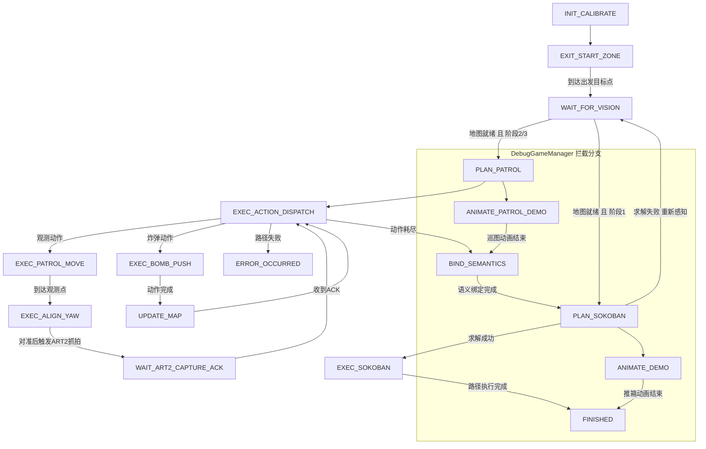

# 第21届全国大学生智能汽车竞赛 - 智能视觉组推箱子主控工程

本仓库是 RT1064 主控侧完整工程，面向智能视觉组推箱子赛题，覆盖了视觉通信、巡图规划、推箱求解、底盘控制、调参与调试显示等核心链路。

当前工程重点：

- 双 OpenART 串口协议联动（ART1 地图与定位，ART2 语义识别）
- 巡图阶段路径规划与动作分发
- 基于 IDA* 的推箱子求解
- 麦轮底盘运动学、轨迹规划与闭环控制
- 面向嵌入式内存约束的静态分配与高性能区段优化

## 1. 硬件与平台

- 主控：NXP i.MX RT1064（Cortex-M7, 600MHz）
- 存储布局：ITCM / DTCM / OCRAM 分区优化
- 底盘：四轮麦克纳姆轮（编码器闭环）
- 视觉：双 OpenART（UART）
- 惯导：IMU 模块（工程内含 ICM42688 与通用 IMU 封装）
- 显示：TFT 菜单与状态可视化

## 2. 工程结构

```text
.
├── project/
│   ├── App/                    # 业务状态机、任务调度、视觉任务、显示与遥测
│   ├── Algorithm/
│   │   ├── Algorithm_Control/  # 运动学、PID、轨迹、跟踪
│   │   ├── Algorithm_Perception/# 里程计、IMU 数据处理
│   │   └── Algorithm_Planning/ # 巡图、策略、Sokoban(IDA*)
│   ├── Device/                 # 电机、编码器、串口、存储、IMU 等设备封装
│   ├── Core/                   # 系统配置、中断、全局调参定义
│   └── mdk/                    # Keil 工程（rt1064.uvprojx）
├── libraries/                  # 底层库、SDK 与外设驱动
├── Algorithm_Planning_Memory_Analysis.md
└── README.md
```

## 3. 软件分层约束

建议继续遵循四层职责边界，减少耦合并提升可维护性：

| 层级目录 | 职责 | 约束 |
| :--- | :--- | :--- |
| `project/App/` | 主循环、状态机、调度、任务编排 | 不直接写寄存器细节 |
| `project/Algorithm/` | 纯算法逻辑（规划、控制、感知融合） | 避免硬件相关宏依赖 |
| `project/Device/` | 外设驱动封装与抽象接口 | 对上层屏蔽底层实现 |
| `project/Core/` | 中断入口、系统配置、全局参数 | 保持稳定、少改动 |


## 4. 运行机制概览

### 4.1 启动初始化顺序（摘自主循环）

- 时钟与调试初始化
- IMU、编码器、存储、通信、菜单、调度器初始化
- 视觉管理与底盘控制初始化
- IMU 开机静态标定
- 启动周期中断（5ms / 20ms）
- 进入主循环：视觉更新 + 游戏状态机更新 + 调度器运行

### 4.2 调度任务（当前配置）

| 任务 | 周期 |
| :--- | :--- |
| 上位机指令解析 | 10ms |
| 波形数据发送 | 20ms |
| TFT UI 刷新 | 100ms |

### 4.3 状态机流程图（GamePhase）



说明：

- 主流程状态机位于 `GameManager::update()`。
- 调试动画分支由 `DebugGameManager::update()` 拦截 `PLAN_PATROL` 与 `PLAN_SOKOBAN` 两个状态实现。
- `ERROR_OCCURRED` 与 `FINISHED` 均会将底盘目标锁定为当前位置，进入停车保持。

## 5. 视觉通信协议摘要

主控与视觉模块采用统一帧格式：

```text
[0xAA][0x55][MsgType][Len][Payload...][Checksum]
Checksum = MsgType + Len + Sum(Payload)
```

关键消息方向：

- 主控 -> ART1：请求地图、请求定位
- 主控 -> ART2：触发抓拍（实体 ID + 是否箱子）
- ART1 -> 主控：地图包、定位包
- ART2 -> 主控：抓拍 ACK、语义识别结果

## 6. 算法与性能说明

- 推箱求解：IDA* + 剪枝策略（含哈希与置换表）
- 巡图规划：结合动作序列分发与执行
- 控制模块：轨迹规划 + 运动学解算 + PID 闭环
- 内存分析参考：`Algorithm_Planning_Memory_Analysis.md`

## 7. 开发规范建议

- 以静态内存为主，避免运行期动态分配
- ISR 与 C/C++ 混编边界保持清晰（必要时使用 `extern "C"`）
- 高频核心函数放置在合适存储区（如 RAM 函数段）
- 调参与状态变量集中管理，避免分散硬编码

## 8. 协作与提交建议

- 仓库已包含 `.gitignore`，用于过滤 Keil 产物与日志
- `project/mdk/MDK删除临时文件.bat` 可用于本地清理临时文件
- 提交前建议至少完成一次全量编译，确认无新增告警与错误

## 9. 许可说明

- 本项目业务代码版权归所属参赛团队。
- 第三方库与 SDK 许可见 `libraries/` 目录及其文档说明。
